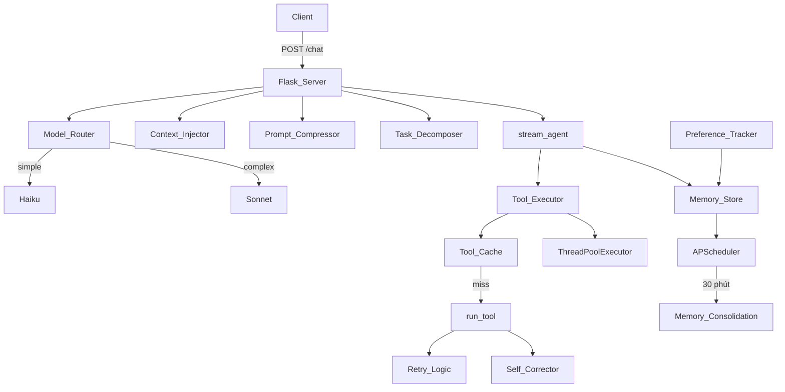

# Tài liệu Thiết kế: Nâng cấp AI Agent Intelligence

## Tổng quan

Tài liệu này mô tả thiết kế kỹ thuật cho 12 tính năng nâng cấp AI Agent backend (Python/Flask). Các tính năng được tổ chức thành 3 nhóm: Accuracy, Intelligence, và Performance. Thiết kế tập trung vào việc tích hợp tối thiểu vào codebase hiện tại, tránh breaking changes, và đảm bảo khả năng mở rộng.

---

## Kiến trúc tổng thể



---

## Các thành phần và giao diện

### 1. Module mới cần tạo

| Module | File | Mô tả |
|--------|------|--------|
| Context_Injector | `ai-agent/utils/context_injector.py` | Thu thập và inject môi trường vào system prompt |
| Task_Decomposer | `ai-agent/utils/task_decomposer.py` | Phân tách task phức tạp thành subtasks |
| Self_Corrector | `ai-agent/utils/self_corrector.py` | Xác minh kết quả sau tool execution |
| Preference_Tracker | `ai-agent/utils/preference_tracker.py` | Theo dõi và lưu sở thích người dùng |
| Tool_Cache | `ai-agent/utils/tool_cache.py` | Cache kết quả tool read-only với TTL |
| Model_Router | `ai-agent/utils/model_router.py` | Phân loại và định tuyến model |
| Prompt_Compressor | `ai-agent/utils/prompt_compressor.py` | Nén lịch sử hội thoại dài |

### 2. Module hiện tại cần sửa đổi

| Module | Thay đổi |
|--------|----------|
| `server.py` | Tích hợp tất cả utils mới vào `stream_agent()` và `run_tool()` |
| `memory/store.py` | Thêm `consolidate_memories()` và background job |
| `tools/desktop.py` | Thêm streaming subprocess cho `run_shell` |

---

## Data Models

### ToolCacheEntry
```python
@dataclass
class ToolCacheEntry:
    result: str
    created_at: float  # timestamp
    ttl: int = 60      # seconds
    
    def is_valid(self) -> bool:
        return (time.time() - self.created_at) < self.ttl
```

### SubTask
```python
@dataclass
class SubTask:
    index: int
    description: str
    status: str  # "pending" | "running" | "done" | "failed"
    result: str = ""
```

### UserPreferences
```python
@dataclass
class UserPreferences:
    language: str = "vi"           # "vi" | "en" | ...
    response_length: str = "medium" # "short" | "medium" | "long"
    format: str = "markdown"        # "markdown" | "plain"
    interaction_count: int = 0
```

### ModelRoutingDecision
```python
@dataclass
class ModelRoutingDecision:
    model: str
    complexity: str  # "simple" | "complex"
    reason: str
```

---

## Thiết kế chi tiết từng tính năng

### Nhóm 1: Accuracy

#### 1.1 Streaming Tool Results

Thay thế `subprocess.run()` trong `desktop.run_shell()` bằng `subprocess.Popen()` với `stdout=PIPE` để đọc từng dòng output.

```python
# tools/desktop.py - hàm mới
def run_shell_streaming(cmd: str, timeout: int = 60):
    """Generator: yield từng dòng output từ shell command."""
    proc = subprocess.Popen(
        cmd, shell=True, stdout=subprocess.PIPE,
        stderr=subprocess.STDOUT, text=True, bufsize=1
    )
    try:
        for line in iter(proc.stdout.readline, ''):
            yield line.rstrip('\n')
        proc.wait(timeout=timeout)
    except subprocess.TimeoutExpired:
        proc.kill()
        yield "__TIMEOUT__"
```

Trong `stream_agent()`, khi tool là `run_shell`, gọi `run_shell_streaming()` và yield từng dòng:

```python
# server.py - trong vòng lặp tool execution
if block.name == "run_shell":
    full_output = []
    for line in desktop.run_shell_streaming(block.input["cmd"]):
        if line == "__TIMEOUT__":
            yield f"data: {json.dumps({'type':'tool_error','name':'run_shell','error':'timeout'})}\n\n"
            break
        yield f"data: {json.dumps({'type':'tool_stream','name':'run_shell','line':line})}\n\n"
        full_output.append(line)
    result = "\n".join(full_output)
```

#### 1.2 Tool Retry Logic

```python
# utils/retry.py
import time, functools

def with_retry(max_retries: int = 3, backoff_base: float = 1.0):
    def decorator(func):
        @functools.wraps(func)
        def wrapper(*args, **kwargs):
            last_error = None
            for attempt in range(max_retries + 1):
                try:
                    return func(*args, **kwargs)
                except Exception as e:
                    last_error = e
                    if attempt < max_retries:
                        wait = backoff_base * (2 ** attempt)
                        time.sleep(wait)
            raise last_error
        return wrapper
    return decorator
```

Áp dụng trong `run_tool()` cho `run_shell` và `browser_*`:

```python
# server.py - run_tool với retry
RETRYABLE_TOOLS = {"run_shell", "browser_navigate", "browser_evaluate", "browser_fill", "browser_click"}

def run_tool_with_retry(name, inputs, yield_fn=None):
    for attempt in range(3):
        try:
            result = run_tool(name, inputs)
            if result.startswith("Error:"):
                raise RuntimeError(result)
            return result
        except Exception as e:
            if attempt < 2:
                wait = 2 ** attempt
                if yield_fn:
                    yield_fn({'type':'tool_retry','name':name,'attempt':attempt+1,'reason':str(e)})
                time.sleep(wait)
    return f"Error after 3 retries: {e}"
```

#### 1.3 Context Injection

```python
# utils/context_injector.py
import subprocess
from datetime import datetime

def get_environment_context() -> str:
    """Thu thập thông tin môi trường và trả về string để inject vào system prompt."""
    parts = []
    
    # Thư mục hiện tại
    try:
        pwd = subprocess.run("pwd", capture_output=True, text=True, timeout=2).stdout.strip()
        parts.append(f"- Thư mục hiện tại: {pwd}")
    except Exception:
        pass
    
    # Thời gian
    parts.append(f"- Thời gian hiện tại: {datetime.now().strftime('%Y-%m-%d %H:%M:%S')}")
    
    # App đang mở
    try:
        script = 'tell application "System Events" to get name of every process whose background only is false'
        apps = subprocess.run(["osascript", "-e", script], capture_output=True, text=True, timeout=3).stdout.strip()
        parts.append(f"- Ứng dụng đang mở: {apps[:200]}")
    except Exception:
        pass
    
    # Màn hình resolution
    try:
        res_script = 'tell application "Finder" to get bounds of window of desktop'
        res = subprocess.run(["osascript", "-e", res_script], capture_output=True, text=True, timeout=2).stdout.strip()
        parts.append(f"- Màn hình: {res}")
    except Exception:
        pass
    
    if not parts:
        return ""
    return "\n[Ngữ cảnh môi trường hiện tại:]\n" + "\n".join(parts)
```

#### 1.4 Structured Output (extract_data tool)

Thêm tool `extract_data` vào `TOOLS` list và xử lý trong `run_tool()`:

```python
# Thêm vào TOOLS list trong server.py
{
    "name": "extract_data",
    "description": "Trích xuất dữ liệu có cấu trúc từ văn bản theo JSON schema",
    "input_schema": {
        "type": "object",
        "properties": {
            "schema": {"type": "object", "description": "JSON schema cho output"},
            "source": {"type": "string", "description": "Văn bản nguồn cần trích xuất"}
        },
        "required": ["schema", "source"]
    }
}

# Trong run_tool()
if name == "extract_data":
    schema = inputs.get("schema", {})
    source = inputs.get("source", "")
    if not schema or not source:
        return "Error: schema và source là bắt buộc"
    
    extract_tool = {"name": "extracted", "description": "Output", "input_schema": schema}
    r = client.messages.create(
        model=DEFAULT_MODEL, max_tokens=1024,
        tools=[extract_tool],
        tool_choice={"type": "tool", "name": "extracted"},
        messages=[{"role": "user", "content": f"Extract data from:\n{source}"}]
    )
    for block in r.content:
        if block.type == "tool_use":
            return json.dumps(block.input, ensure_ascii=False, indent=2)
    return "Error: không trích xuất được dữ liệu"
```

---

### Nhóm 2: Intelligence

#### 2.1 Memory Consolidation

```python
# memory/store.py - thêm hàm consolidate
def consolidate_old_memories(anthropic_client) -> dict:
    """Tóm tắt session memories cũ thành facts ngắn gọn."""
    cutoff = datetime.now().timestamp() - 1800  # 30 phút trước
    
    # Lấy session memories cũ
    all_mems = _memories.get(include=["documents", "metadatas", "ids"])
    old_ids, old_docs = [], []
    for i, meta in enumerate(all_mems["metadatas"]):
        if (meta.get("category") == "session" and 
            datetime.fromisoformat(meta.get("timestamp","1970-01-01")).timestamp() < cutoff):
            old_ids.append(all_mems["ids"][i])
            old_docs.append(all_mems["documents"][i])
    
    if len(old_docs) < 5:
        return {"consolidated": 0, "reason": "not enough memories"}
    
    # Gọi Haiku để tóm tắt
    combined = "\n".join(old_docs)
    r = anthropic_client.messages.create(
        model="claude-haiku-4-5", max_tokens=512,
        messages=[{"role": "user", "content": 
            f"Tóm tắt các memories sau thành tối đa 3 facts ngắn gọn (mỗi fact 1 dòng):\n{combined}"}]
    )
    facts_text = r.content[0].text
    facts = [f.strip() for f in facts_text.split("\n") if f.strip()][:3]
    
    # Lưu facts mới, xóa cũ
    for fact in facts:
        save_memory(fact, {"category": "consolidated_fact"})
    _memories.delete(ids=old_ids)
    
    return {"consolidated": len(old_ids), "facts_created": len(facts)}
```

Đăng ký APScheduler job trong `server.py`:

```python
scheduler.add_job(
    lambda: memory_store.consolidate_old_memories(client),
    'interval', minutes=30, id='memory_consolidation'
)
```

#### 2.2 Task Decomposition

```python
# utils/task_decomposer.py
def decompose_task(task: str, anthropic_client) -> list[str]:
    """Phân tách task phức tạp thành subtasks. Trả về list rỗng nếu task đơn giản."""
    word_count = len(task.split())
    if word_count <= 50:
        return []
    
    r = anthropic_client.messages.create(
        model="claude-haiku-4-5", max_tokens=512,
        messages=[{"role": "user", "content": 
            f"Chia task sau thành 3-6 subtasks ngắn gọn, mỗi subtask 1 dòng, bắt đầu bằng số thứ tự:\n{task}"}]
    )
    lines = r.content[0].text.strip().split("\n")
    subtasks = []
    for line in lines:
        line = line.strip()
        if line and (line[0].isdigit() or line.startswith("-")):
            # Loại bỏ số thứ tự và dấu gạch đầu dòng
            cleaned = line.lstrip("0123456789.-) ").strip()
            if cleaned:
                subtasks.append(cleaned)
    return subtasks[:6]
```

Tích hợp vào `stream_agent()`:

```python
# Đầu stream_agent(), trước vòng lặp chính
subtasks = task_decomposer.decompose_task(query, client)
if subtasks:
    yield f"data: {json.dumps({'type':'decomposition','subtasks':subtasks})}\n\n"
```

#### 2.3 Self-Correction

```python
# utils/self_corrector.py
def verify_write_file(path: str, expected_content: str, run_tool_fn) -> dict:
    """Xác minh file đã được ghi đúng."""
    actual = run_tool_fn("read_file", {"path": path})
    success = expected_content.strip() in actual or actual.strip() == expected_content.strip()
    return {"success": success, "expected_len": len(expected_content), "actual_len": len(actual)}

def verify_browser_navigate(url: str, run_tool_fn) -> dict:
    """Xác minh browser đã navigate đúng URL."""
    title = run_tool_fn("browser_evaluate", {"js": "document.title + ' | ' + window.location.href"})
    success = not title.startswith("Error:")
    return {"success": success, "page_info": title[:200]}
```

Tích hợp vào vòng lặp tool execution trong `stream_agent()`:

```python
# Sau khi run_tool() trả về kết quả
if block.name == "write_file" and not result.startswith("Error"):
    verification = self_corrector.verify_write_file(
        block.input["path"], block.input["content"], run_tool
    )
    event_type = "verification_passed" if verification["success"] else "verification_failed"
    yield f"data: {json.dumps({'type':event_type,'tool':'write_file','detail':verification})}\n\n"
```

#### 2.4 User Preference Learning

```python
# utils/preference_tracker.py
import langdetect

def detect_preferences(message: str, response_length: int) -> dict:
    """Phát hiện preferences từ message và response."""
    prefs = {}
    
    # Ngôn ngữ
    try:
        prefs["language"] = langdetect.detect(message)
    except Exception:
        prefs["language"] = "vi"
    
    # Độ dài response
    if response_length < 200:
        prefs["response_length"] = "short"
    elif response_length < 800:
        prefs["response_length"] = "medium"
    else:
        prefs["response_length"] = "long"
    
    return prefs

def load_preferences(memory_store) -> UserPreferences:
    """Load preferences từ memory."""
    results = memory_store.search_memory("user_preference", n_results=1)
    for r in results:
        if r["metadata"].get("category") == "user_preference":
            try:
                return json.loads(r["content"])
            except Exception:
                pass
    return {"language": "vi", "response_length": "medium", "format": "markdown"}

def save_preferences(prefs: dict, memory_store):
    """Lưu preferences vào memory (overwrite)."""
    # Xóa preference cũ
    existing = memory_store.search_memory("user_preference", n_results=5)
    for r in existing:
        if r["metadata"].get("category") == "user_preference":
            memory_store.delete_memory(r["metadata"].get("id",""))
    memory_store.save_memory(json.dumps(prefs), {"category": "user_preference"})
```

---

### Nhóm 3: Performance

#### 3.1 Tool Parallelism

```python
# utils/tool_parallel.py
from concurrent.futures import ThreadPoolExecutor, as_completed

INDEPENDENT_TOOLS = {"run_shell", "read_file", "recall", "screenshot_and_analyze"}

def can_run_parallel(tool_blocks: list) -> bool:
    """Kiểm tra xem các tool calls có thể chạy song song không."""
    names = [b.name for b in tool_blocks]
    # Chỉ parallel nếu tất cả là independent tools
    return all(n in INDEPENDENT_TOOLS for n in names) and len(names) > 1

def run_tools_parallel(tool_blocks: list, run_tool_fn, max_workers: int = 5) -> list[dict]:
    """Chạy tool calls song song, trả về list kết quả theo thứ tự."""
    results = [None] * len(tool_blocks)
    
    with ThreadPoolExecutor(max_workers=min(len(tool_blocks), max_workers)) as executor:
        futures = {
            executor.submit(run_tool_fn, b.name, b.input): i
            for i, b in enumerate(tool_blocks)
        }
        for future in as_completed(futures):
            idx = futures[future]
            try:
                results[idx] = future.result()
            except Exception as e:
                results[idx] = f"Error: {e}"
    
    return results
```

#### 3.2 Response Caching

```python
# utils/tool_cache.py
import time, re
from dataclasses import dataclass, field

READ_ONLY_COMMANDS = {"ps", "df", "uname", "date", "whoami", "hostname", "uptime", "sw_vers"}
UNSAFE_PATTERNS = re.compile(r'[|><$`]')

@dataclass
class CacheEntry:
    result: str
    created_at: float = field(default_factory=time.time)
    ttl: int = 60

    def is_valid(self) -> bool:
        return (time.time() - self.created_at) < self.ttl

_cache: dict[str, CacheEntry] = {}

def is_cacheable(cmd: str) -> bool:
    if UNSAFE_PATTERNS.search(cmd):
        return False
    base_cmd = cmd.strip().split()[0] if cmd.strip() else ""
    return base_cmd in READ_ONLY_COMMANDS

def get_cached(cmd: str) -> str | None:
    entry = _cache.get(cmd)
    if entry and entry.is_valid():
        return entry.result
    if entry:
        del _cache[cmd]
    return None

def set_cache(cmd: str, result: str):
    _cache[cmd] = CacheEntry(result=result)
```

Tích hợp vào `run_tool()`:

```python
if name == "run_shell":
    cmd = inputs["cmd"]
    if tool_cache.is_cacheable(cmd):
        cached = tool_cache.get_cached(cmd)
        if cached is not None:
            return cached
    result = desktop.run_shell(cmd)
    if tool_cache.is_cacheable(cmd):
        tool_cache.set_cache(cmd, result)
    return result
```

#### 3.3 Model Routing

```python
# utils/model_router.py
SIMPLE_KEYWORDS = {"xin chào", "hello", "hi", "cảm ơn", "thanks", "tóm tắt ngắn", "format", "dịch"}
COMPLEX_KEYWORDS = {"viết code", "lập trình", "phân tích", "tìm kiếm", "tải", "cài đặt", "chạy", "mở"}
HAIKU_MODEL = "claude-haiku-4-5"
SONNET_MODEL = "claude-sonnet-4-5"

def route_model(message: str, has_tool_history: bool = False, user_specified_model: str = None) -> ModelRoutingDecision:
    if user_specified_model:
        return ModelRoutingDecision(model=user_specified_model, complexity="user_specified", reason="user override")
    
    msg_lower = message.lower()
    word_count = len(message.split())
    
    # Complex nếu: >30 từ, có tool keywords, hoặc có tool history
    if word_count > 30 or has_tool_history or any(kw in msg_lower for kw in COMPLEX_KEYWORDS):
        return ModelRoutingDecision(model=SONNET_MODEL, complexity="complex", reason=f"words={word_count}")
    
    if any(kw in msg_lower for kw in SIMPLE_KEYWORDS):
        return ModelRoutingDecision(model=HAIKU_MODEL, complexity="simple", reason="simple keywords")
    
    # Default: complex để an toàn
    return ModelRoutingDecision(model=SONNET_MODEL, complexity="complex", reason="default")
```

#### 3.4 Prompt Compression

```python
# utils/prompt_compressor.py
COMPRESSION_THRESHOLD = 20
KEEP_RECENT = 4

def compress_history(messages: list, anthropic_client) -> tuple[list, dict]:
    """Nén lịch sử nếu vượt ngưỡng. Trả về (new_messages, compression_info)."""
    if len(messages) <= COMPRESSION_THRESHOLD:
        return messages, {}
    
    old_messages = messages[:-KEEP_RECENT]
    recent_messages = messages[-KEEP_RECENT:]
    
    # Tạo text để tóm tắt
    history_text = "\n".join([
        f"{m['role'].upper()}: {m['content'] if isinstance(m['content'], str) else '[complex content]'}"
        for m in old_messages
    ])
    
    r = anthropic_client.messages.create(
        model="claude-haiku-4-5", max_tokens=600,
        messages=[{"role": "user", "content": 
            f"Tóm tắt cuộc hội thoại sau trong tối đa 500 từ, giữ lại các điểm quan trọng:\n{history_text}"}]
    )
    summary = r.content[0].text
    
    summary_message = {
        "role": "user",
        "content": f"[Tóm tắt hội thoại trước:]\n{summary}"
    }
    
    new_messages = [summary_message] + recent_messages
    info = {"compressed_count": len(old_messages), "summary_length": len(summary.split())}
    return new_messages, info
```

---

## Correctness Properties

*Một property là đặc tính hoặc hành vi phải đúng trong mọi lần thực thi hợp lệ của hệ thống — về cơ bản là một phát biểu hình thức về những gì hệ thống phải làm. Properties là cầu nối giữa đặc tả dạng văn bản và đảm bảo tính đúng đắn có thể kiểm chứng tự động.*


### Property 1: Streaming output completeness
*For any* shell command, joining tất cả các lines được yield bởi `run_shell_streaming()` phải tạo ra output tương đương với kết quả của `run_shell()` trên cùng lệnh đó.
**Validates: Requirements 1.1, 1.3**

### Property 2: Retry count và backoff
*For any* tool call luôn thất bại, số lần gọi tool phải đúng bằng 3, và các khoảng thời gian chờ giữa các lần thử phải là [1s, 2s, 4s] theo thứ tự. Nếu lần thứ N thành công (N < 3), không được có lần gọi thứ N+1.
**Validates: Requirements 2.1, 2.2, 2.3, 2.5**

### Property 3: Context injection completeness
*For any* lần gọi `get_environment_context()`, kết quả trả về phải chứa ít nhất thông tin thời gian hiện tại. Nếu một source thất bại, các sources khác vẫn phải xuất hiện trong output.
**Validates: Requirements 3.1, 3.2, 3.3, 3.4, 3.5, 3.6**

### Property 4: Extract data schema conformance
*For any* JSON schema hợp lệ và source text không rỗng, output của `extract_data` phải là JSON object có thể validate được với schema đó.
**Validates: Requirements 4.2**

### Property 5: Memory consolidation reduces count
*For any* tập hợp từ 5 session memories cũ trở lên, sau khi `consolidate_old_memories()` chạy thành công, tổng số memories phải giảm (memories cũ bị xóa, facts mới được tạo với số lượng ≤ 3).
**Validates: Requirements 5.2, 5.3, 5.4**

### Property 6: Task decomposition threshold
*For any* task string, nếu số từ > 50 thì `decompose_task()` phải trả về list không rỗng; nếu số từ ≤ 50 thì phải trả về list rỗng.
**Validates: Requirements 6.1, 6.5**

### Property 7: Write-then-read round trip
*For any* file path và content string, sau khi `write_file` thành công và `Self_Corrector` chạy verification, nội dung đọc lại từ file phải chứa content đã ghi.
**Validates: Requirements 7.1**

### Property 8: Preference save-load round trip
*For any* preferences dict, sau khi `save_preferences()` và `load_preferences()`, giá trị trả về phải tương đương với giá trị đã lưu.
**Validates: Requirements 8.1, 8.4**

### Property 9: Cache read-only commands
*For any* read-only command không chứa ký tự unsafe (|, >, $), lần gọi thứ hai trong vòng 60 giây phải trả về kết quả từ cache (không thực thi lại). Lệnh chứa ký tự unsafe không được cache.
**Validates: Requirements 10.1, 10.2, 10.6**

### Property 10: Model routing correctness
*For any* message, nếu `user_specified_model` được set thì model trong decision phải bằng giá trị đó. Nếu không, message có >30 từ hoặc chứa tool keywords phải được route đến Sonnet; message ngắn với simple keywords phải được route đến Haiku.
**Validates: Requirements 11.1, 11.2, 11.3, 11.6**

### Property 11: Prompt compression reduces history length
*For any* message history có độ dài > 20, sau khi `compress_history()` chạy thành công, độ dài history mới phải bằng KEEP_RECENT + 1 (4 messages gần nhất + 1 summary message).
**Validates: Requirements 12.1, 12.2, 12.3**

---

## Xử lý lỗi

| Tình huống | Hành vi |
|-----------|---------|
| Shell command timeout | Yield `tool_error` event, dừng stream |
| Tất cả retries thất bại | Trả về error message với số lần thử |
| Context injection source fail | Bỏ qua source đó, tiếp tục với sources còn lại |
| Haiku API fail (consolidation) | Giữ nguyên memories gốc, log lỗi |
| Haiku API fail (compression) | Giữ nguyên history gốc, log warning |
| extract_data schema không hợp lệ | Trả về error message mô tả vấn đề |
| Verification thất bại | Yield `verification_failed`, retry tool một lần |
| Parallel tool fail | Báo lỗi riêng cho tool đó, tiếp tục các tools còn lại |

---

## Testing Strategy

### Dual Testing Approach

Sử dụng kết hợp **unit tests** và **property-based tests** để đảm bảo coverage toàn diện:

- **Unit tests**: Kiểm tra các ví dụ cụ thể, edge cases, error conditions
- **Property tests**: Kiểm tra các universal properties trên nhiều inputs ngẫu nhiên

### Property-Based Testing

Sử dụng thư viện **Hypothesis** (Python) cho property-based testing.

Cấu hình mỗi property test chạy tối thiểu 100 iterations:

```python
from hypothesis import given, settings, strategies as st

@settings(max_examples=100)
@given(st.text(min_size=1))
def test_property_N(input_data):
    # Feature: agent-intelligence-upgrade, Property N: <property_text>
    ...
```

### Unit Testing

Sử dụng **pytest** với **unittest.mock** để mock external dependencies (Anthropic API, subprocess, ChromaDB).

Tập trung vào:
- Specific examples cho từng tính năng
- Edge cases (empty input, timeout, API failure)
- Integration points giữa các modules

### Test File Structure

```
ai-agent/tests/
├── test_tool_cache.py          # Property 9
├── test_model_router.py        # Property 10
├── test_prompt_compressor.py   # Property 11
├── test_retry_logic.py         # Property 2
├── test_context_injector.py    # Property 3
├── test_task_decomposer.py     # Property 6
├── test_self_corrector.py      # Property 7
├── test_preference_tracker.py  # Property 8
├── test_memory_consolidation.py # Property 5
└── test_streaming.py           # Property 1
```
